### zsh_prompt_with_random_colors
if you spend a lot of time in the terminal you'll know how boring it gets looking at that same prompt over and over again so lets add some variety to how it looks

### before you start
make sure to install ohmyzsh before doing anything, it makes some changes to how zsh works and improves your experience vastly

lets also comment out the line about the prompt because we are making our own

``` 
# ZSH_THEME="robbyrussell"
```

### my color pallete

| number | hex | image | number | hex | image |
|---|---|---|---|---|---|
| 0 | #1e1e1e |  | 8 | #777777 |  |
| 1 | #fe0094 |  | 9 | #fe0094 |  |
| 2 | #82b414 |  | 10 | #82b414 |  |
| 3 | #FD971F |  | 11 | #FD971F |  |
| 4 | #459ee0 |  | 12 | #459ee0 |  |
| 5 | #A376FE |  | 13 | #A376FE |  |
| 6 | #00c2f5 |  | 14 | #00c2f5 |  |
| 7 | #b9b9b9 |  | 15 | #b9b9b9 | 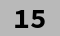 | 

### how?
as you probably know `%F{}` is to set colors in your prompt, `%f` will reset the color to normal, what you do is sandwich a section or the whole of your prompt that you want to apply color between these 2, something like this for example

```
PROMPT='%F{1}junguler%F{2}@%F{3}nowhere%f  '
```

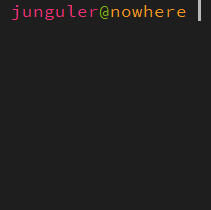

using that same pattern we can use the built in '$RANDOM' variable to set a random color for each time you press inter or use a command in your shell

```
PROMPT='%F{$(($RANDOM%6+1))}junguler%F{$(($RANDOM%6+1))}@%F{$(($RANDOM%6+1))}nowhere%f '
```

this will apply a random color between 1 and 6 each time, which will result in one of the following colors: red, green, yellow, blue, magenta or cyan

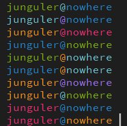

now that you know how easy it is to get things going you can apply the same method to all of the items in your prompt, note that you don't need to reset the color each time if the next item is also going to get it's own color, just at the end of your prompt or when you want a section of your prompt to be the default color

here as example of my own prompt including time, current working directory and the status code of the last command that ran

```
PROMPT='%F{$(($RANDOM%6+1))}%D{%H:%M} % %F{$(($RANDOM%6+1))}%1~ %F{$(($RANDOM%6+1))}%?%f '
```

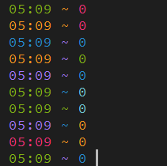

looks cool but it's a little empty, so lets add some square brackets to make it look better and also give us a few more things to randomly color

```
PROMPT='%F{$(($RANDOM%6+1))}[%F{$(($RANDOM%6+1))}%D{%H:%M}%F{$(($RANDOM%6+1))}] %F{$(($RANDOM%6+1))}[%F{$(($RANDOM%6+1))}%1~%F{$(($RANDOM%6+1))}] %F{$(($RANDOM%6+1))}[%F{$(($RANDOM%6+1))}%?%F{$(($RANDOM%6+1))}]%f '
```

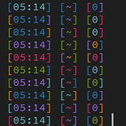

### what about 256 colors

the same method also applies with 256 colors, just adjust the RANDOM numbers to `$((RANDOM%215+16))`, note that many of these colors have poor contrast against each other and possibly the background color of you terminal emulator 

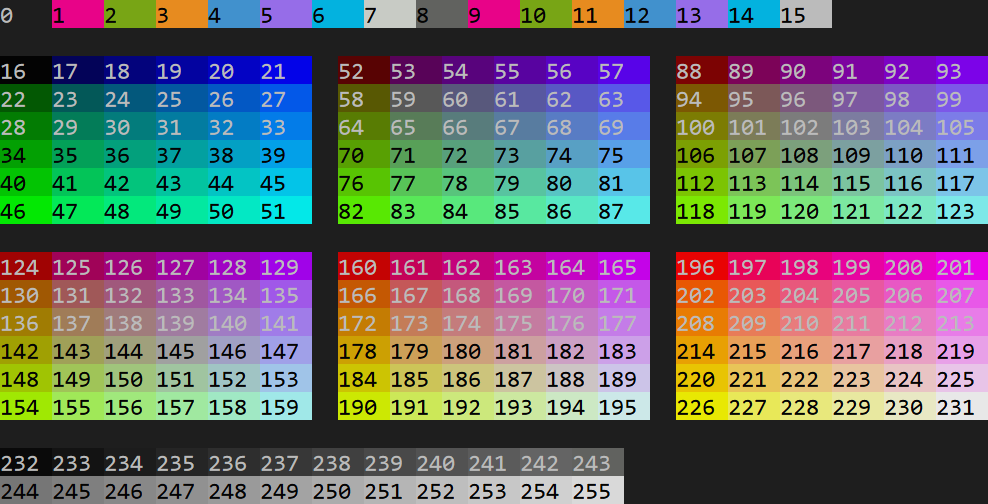

you can't usually change how the colors 16-255 look unless you are on a terminal emulator that supports filters or css, what you see is what you get pretty much

```
PROMPT='%F{$((RANDOM%215+16))}[%F{$((RANDOM%215+16))}%D{%H:%M}%F{$((RANDOM%215+16))}] %F{$((RANDOM%215+16))}[%F{$((RANDOM%215+16))}%1~%F{$((RANDOM%215+16))}] %F{$((RANDOM%215+16))}[%F{$((RANDOM%215+16))}%?%F{$((RANDOM%215+16))}]%f '
```

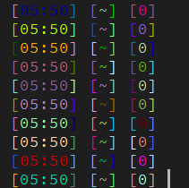

### more control using ranges of colors
too much randomness leads to ugly results as you can see from the above picture, so lets use ranges of colors to better control our prompts while still having the option of variety of colors to choose from

lets look at the 6 color blocks that include the colors of 256-xterm color pallete

| 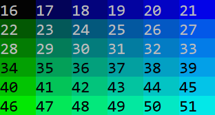 | 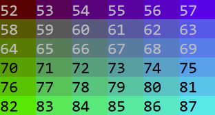 | 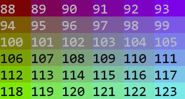 |
|---|---|---|
| 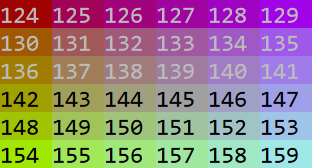 | 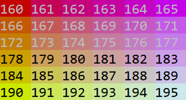 | 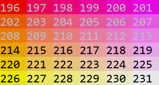 |

as you can see there are quite a few good color combinations to choose from but not all of them are beside each other

the `$RANDOM` variable doesn't give you the option to choose from several ranges of colors but it does have the option of using simple math to exclude numbers we don't want so we can have a better range of colors, so lets show some examples to make this easy to understand

| direction | code | image | 
|---|---|---|
| top to bottom | `$((162+($RANDOM%6)*6))` | 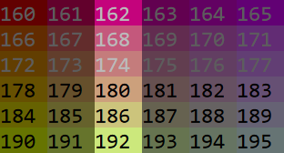 |
| left to right | `$((160+($RANDOM%6)))` | 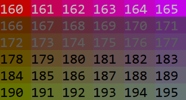 |
| top-left to bottom-right | `$((160+($RANDOM%6)*7))` | 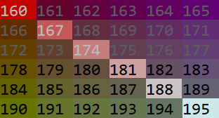 |
| top-right to bottom-left | `$((163+($RANDOM%6)*5))` | 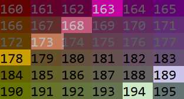 |

as you can see it's quite easy to get a range of colors from each block of 6x6, just start with the number you want and apply it to the `$RANDOM` variable

### some interesting combinations to consider
having learned how it works lets make some color palletes to use for our random prompts

| theme | code | colors | image | 
|---|---|---|---|
| warm | `$((196+($RANDOM%6)*6))` |       | 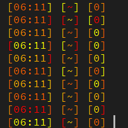 |
| cold | `$((93+($RANDOM%6)*6))` |       | 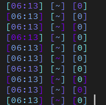 |
| purple/green | `$((93+($RANDOM%6)*5))` |       | 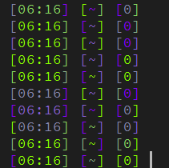 |
| pink/yellow | `$((201+($RANDOM%6)*5))` |       | 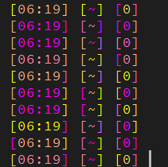 |

### multi color pallete prompt
so far we decided on a color pallete and applied it to the whole of the prompt but because it's all modular it's really easy to have several color combinations at once

| code | colors | 
|---|---|
| $((RANDOM%6+46))
 |       |
| $((57+($RANDOM%6)*6))
 |       |
| $((93+($RANDOM%6)*6))
 |       |
| $((129+($RANDOM%6)*5))
 |       |
| $((RANDOM%6+196))
 |       |
| $((196+($RANDOM%6)*6))
 |       |
| $((201+($RANDOM%6)*5))
 |       |


```
PROMPT='%F{$(($RANDOM%6+46))}[%F{$(($RANDOM%6+46))}%D{%H:%M}%F{$(($RANDOM%6+46))}] %F{$(($RANDOM%6+196))}[%F{$(($RANDOM%6+196))}%1~%F{$(($RANDOM%6+196))}] %F{$((201+($RANDOM%6)*5))}[%F{$((201+($RANDOM%6)*5))}%?%F{$((201+($RANDOM%6)*5))}]%f '
```


### background colors
using the same methods we learned it's easy to apply a background color to your prompt using `$K{}` and `$k`

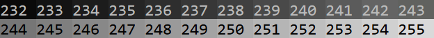

```
$(($RANDOM%7+232))
```

which uses color numbers between 232 to 238

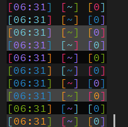

just make sure to keep the contrast level enough to have the prompt easily readable

### add variables
the code works but it's too complicated to change, so lets add a few variables to `.zshrc` to make life easier

```
local l_l='['
local r_r=']'
local s_s=' '
local _01='$(($RANDOM%6+1))'
```

so lets unpack this, `l_l='['` is the left braket, `local r_r=']'` the right bracket, `local s_s=' '` the white space between the prompt sections and `_01='$(($RANDOM%6+1))'` is the first instance of our random color

the random color variable is only good for one time in the prompt so we need to make a new one for every time we need a random color

you can use these variables in your prompt by simply adding a dollar sign `$` behind them like this `$_01`

so lets tidy up that prompt from the above example and make it way more usable, lets also add more color variables to the `.zshrc` make sure to place them above the prompt

```
local l_l='['
local r_r=']'
local s_s=' '
local _01='$(($RANDOM%6+1))'
local _02='$(($RANDOM%6+1))'
local _03='$(($RANDOM%6+1))'
local _04='$(($RANDOM%6+1))'
local _05='$(($RANDOM%6+1))'
local _06='$(($RANDOM%6+1))'
local _07='$(($RANDOM%6+1))'
local _08='$(($RANDOM%6+1))'
local _09='$(($RANDOM%6+1))'
```

```
PROMPT='%F{$(($_01))}${l_l}%F{$(($_02))}%D{%H:%M}%F{$(($_03))}${r_r}${s_s}%F{$(($_04))}${l_l}%F{$(($_05))}%1~%F{$(($_06))}${r_r}${s_s}%F{$(($_07))}${l_l}%F{$(($_08))}%?%F{$(($_09))}${r_r}%f '
```

the other benefit of having a variable in your prompt is you can just as easily change everything about those variables and have it automatically take effect in the prompt, so lets show and example of this

say i don't want to have square brakets in my prompt, lets change them to parentheses like this ``local l_l='('`` ``local l_l=')'``

same thing applies for your color variables